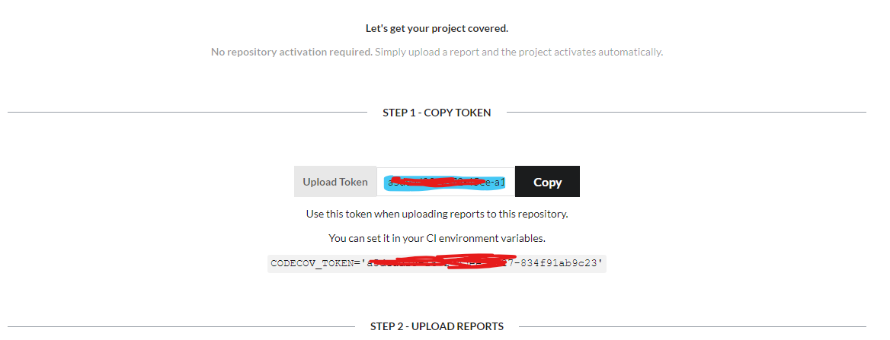
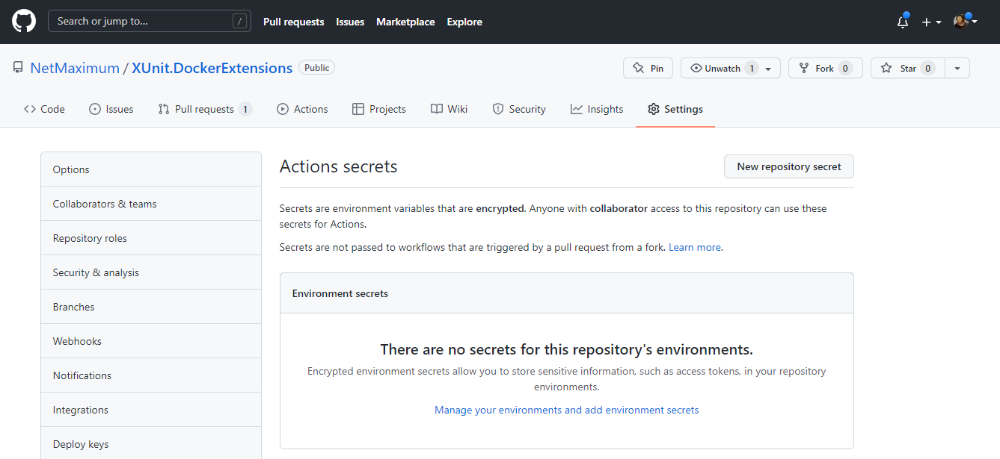
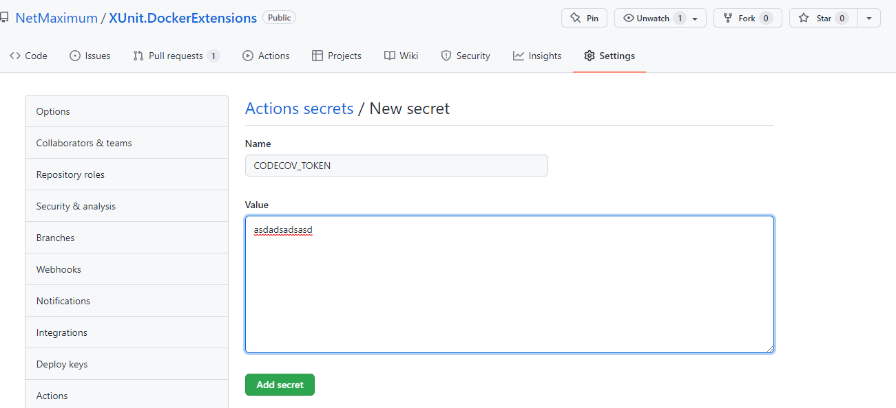
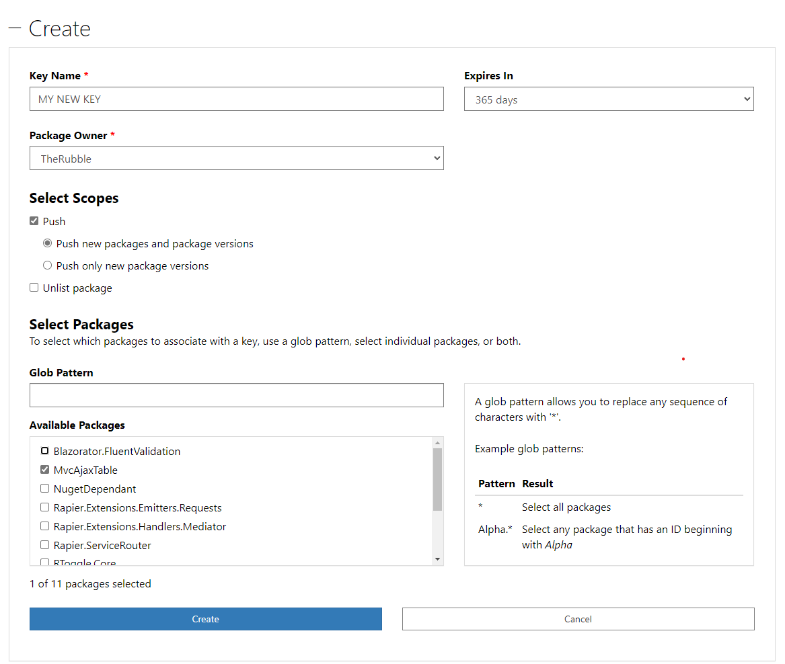
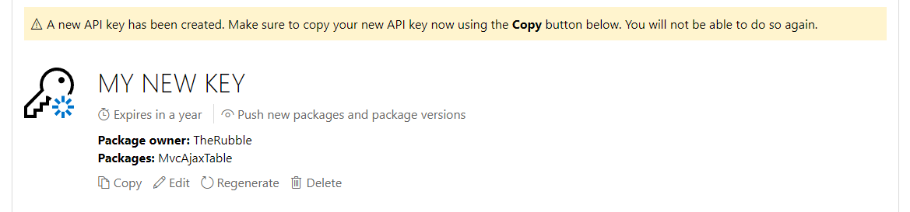
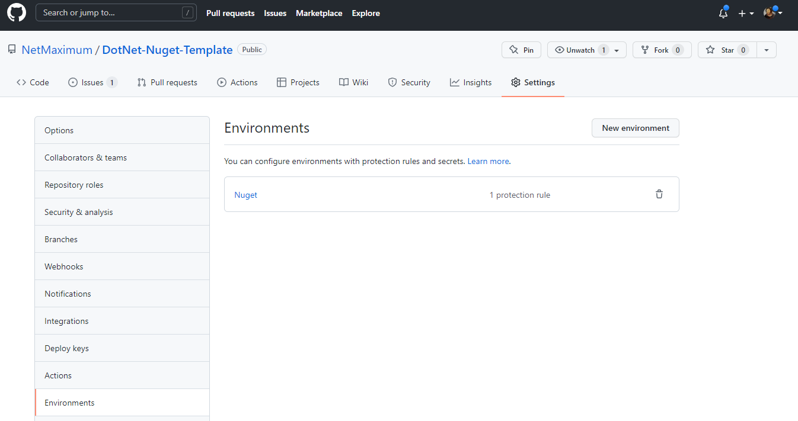
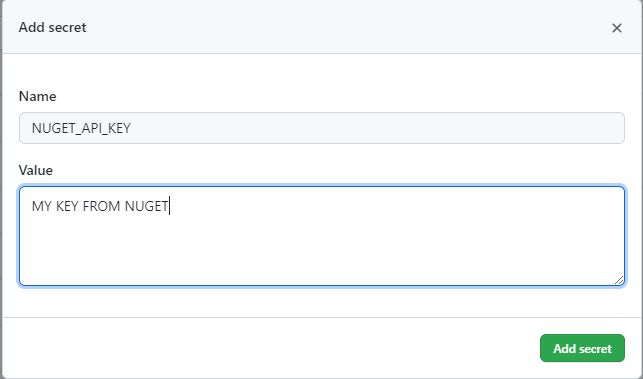

# Netmaximum.ProtonLock 

## Setting up [codecov.io](https://about.codecov.io)

To enable coverage reports on [codecov.io](https://about.codecov.io), you need to link your [GitHub](https://github.com) account with codecov. This is part of the standard setup process.

Once linked you should be able to find the repo you wish to link buy clicking the "Not Yet Setup" button.

Click "Setup Repo"

And copy the CI environment variable.

Next navigate to your repo on [GitHub](https://github.com) and locate the repository secrets page (Don't confuse this with user or organisation secrets).

Finally click "New repository secret" and add the variable from the CodeCov page.

Builds should now report code coverage data CodeCov.io

## Setup a nuget key for pushing to [Nuget](https://nuget.org)

*It's worth noting that a nuget key might exist at organisation level, if this is the case you won't need to add it during the environment creation step*

### Create a new key

Click "Create"

~~~~

Upon creation make sure to copy the key.

### Create an environment in [GitHub](https://github.com)

Create a new environment in [GitHub](https://github.com) called "Nuget", the name is important as it's linked in the [GitHub](https://github.com) action.

Finally add the nuget key to the environment as a secret using the key "NUGET_API_KEY" (Not needed if stored at organisation level)

At this point you could setup an environment restriction so only certain people can migrate the package from [GitHub](https://github.com) to nuget.

